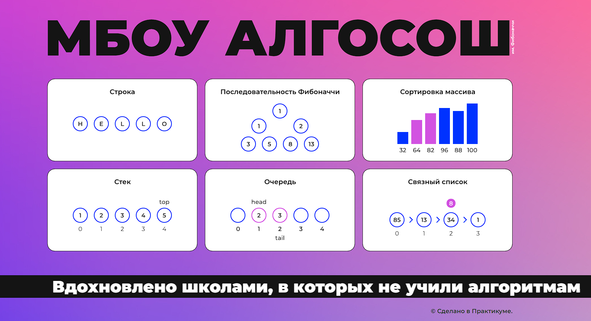

# :arrows_counterclockwise: Algososh
[Ссылка на проект](https://aleksandrazolotukhina.github.io/Algososh/)
<br>
[Дизайн проекта](https://www.figma.com/file/RIkypcTQN5d37g7RRTFid0/Algososh_external_link?node-id=0%3A1)
<p align="center">
     
</p>

### Описание проекта 
Algososh - визуализатор алгоритмов.
Проектная работа заточена на анимацию и поэтапное отображение работы алгоритма, что позволит детальнее понять каждый шаг его работы.
<br>
Визуализация алгоритмов и структур данных в данной работе:
- стек
- очередь
- связный список
- сортировка пузырьком
- сортировка вставками
- последовательность Фибоначчи

### Используемые технологии 
- React
- Redux
- TypeScript

### Запуск проекта

1. Склонируйте репозиторий к себе на компьютер
```
git clone https://github.com/AleksandraZolotukhina/Algososh.git
```

2. Установите зависимости проекта
```
npm ci
```

3. Запустите проект
```
npm start
```